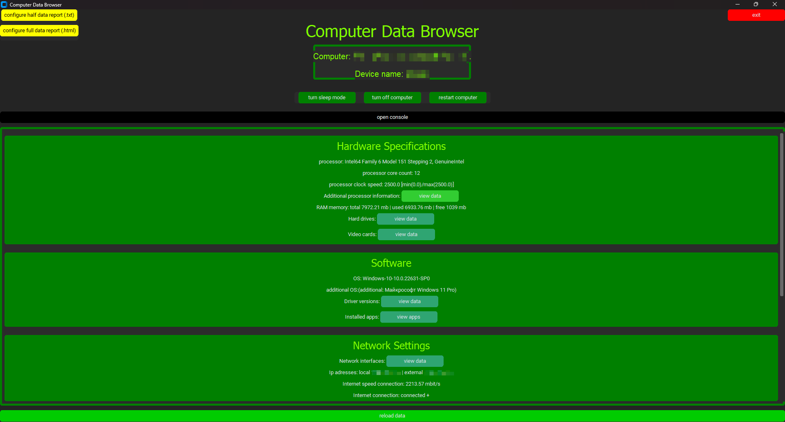

# Computer-Data-Browser
Computer Data Browser app.

This is my first project at over 1000 lines of code. The application takes computer data (RAM memory, CPU data, drivers, installed applications, internet speed and other system data). You can also generate data reports in the form of text and html files. A text report records small data, while an html file records all data including large data (driver data, disk data...). It is also possible to restart the application and open the console.

<h1>Requierements:</h1>

##
    pip install customtkinter

##
    pip install tkinter

##
    pip install pywifi

##
    pip install psutil

##
    pip install requests

## 
    pip install WMI
